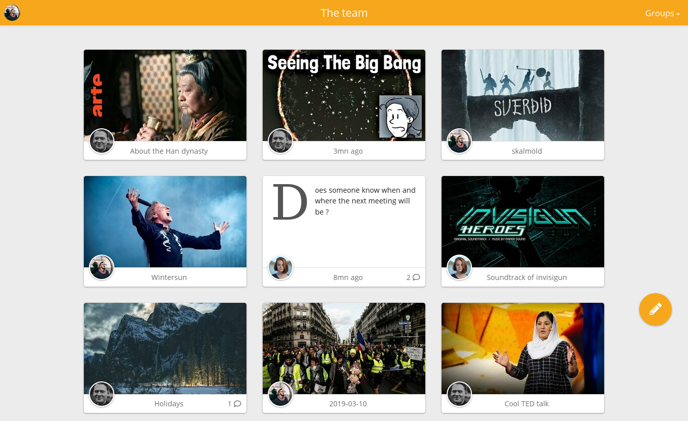

<h1 align="center">
    
</h1>

<h4 align="center">A truly private space for you and your friends</h4>

## What is Zusam ?
Zusam (/tsuˈzam/) is a free and open-source way to self-host private forums for groups of friends. Composed of a server written in PHP exposing a REST API and a lightweight webapp, Zusam is extensible and easy to install.  
The goal is to make a stable, extensible, lightweight and user-friendly way to self-host private social groups.

    

<em>More screenshots <a href="readme">here</a></em>

## Demo
You can test Zusam right now on https://demo.zusam.org  
The login is "zusam" and the password is "zusam". The instance is reset every hour.

## Features
- Links preview and embedded youtube, vimeo, imgur, soundcloud, twitch, bandcamp...
- Video and image upload
- Photo albums
- Public link generation for messages
- Completely responsive and mobile friendly
- Low server footprint

## Deployment
Zusam is composed of a PHP server and a single-page-application.
The backend uses [Symfony](https://symfony.com) and [Sqlite](https://sqlite.org/index.html), the frontend is made with [Preact](https://preactjs.com/) and [ParcelJS](https://parceljs.org/).

Requirements:
- PHP 7.2+ (with mbstring, curl, xml, sqlite3, imagick and intl extensions)
- Ffmpeg 3+
- Yarn or NPM (only to compile the webapp)

You can follow the installation guide for [Debian stretch](documentation/debian.md) or use [Docker](documentation/docker.md).

## Status
The project has the goal of being really stable for the backend once 1.0 is hit. That means no database structure changes, an update system and a stable API.  
The webapp can still change a lot after that point.  
For now, Zusam is completely usable in a day-to-day basis but is subject to significative evolutions with upcoming updates and doesn't garantee backwards compatibility.  
I try my best to make updates as easy as possible.

## Webapp compatibility
The webapp targets latest versions of Firefox, Chrome and Safari. It should also work with Firefox ESR, Edge and older versions of Chrome.

## Contributing
Zusam is free and open-source software licensed under [AGPLv3](https://www.gnu.org/licenses/agpl.html).  
You can open issues for bugs you've found or features you think are missing. You can also submit pull requests to this repository.
